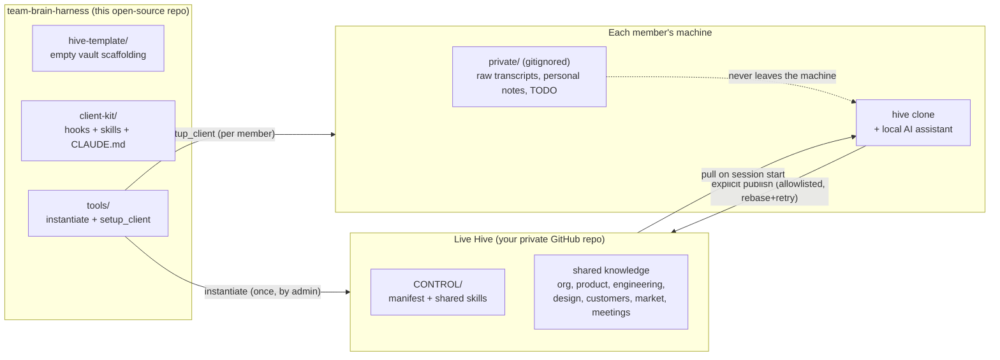
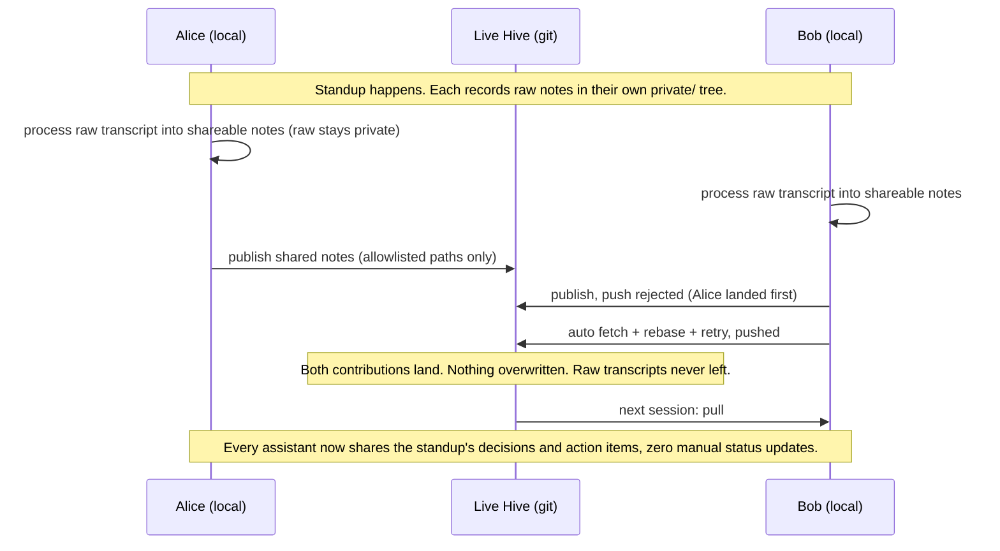

# team-brain-harness

-blue)  

A shared, git-synced "team brain" that every member's AI assistant reads from and writes to, so the whole team's knowledge is one pull away, while each person's private notes never leave their machine.

> **New here?** Read [The problem](#the-problem) and [What's in it for you](#whats-in-it-for-you). **Ready to use it?** Jump to [Quick start](#quick-start) or the full [getting-started guide](docs/getting-started.md).

---

## The problem

Your team's context is scattered: decisions in one person's head, a customer signal in someone's DMs, an architecture rationale buried in a doc nobody re-reads. Worse, everyone now works alongside an AI assistant, and each assistant is an island. It knows *your* files and *your* history, but it has no idea what the person next to you decided this morning. So the same questions get re-asked, context gets re-explained, and knowledge walks out the door when people do.

**team-brain-harness** gives a cross-functional group (engineers, PMs, UX, support, sales) one shared brain that every member's local AI assistant syncs against automatically. Publish what should be shared; keep private what should stay private; the whole team, and every team member's assistant, stays in sync.

## What's in it for you

- **Your assistant knows what the team knows.** It opens each session already caught up on the group's decisions, projects, customers, and context, not just your own files.
- **Stop re-explaining and status-chasing.** Shared decisions, action items, and meeting outcomes land in the brain. Anyone (or their assistant) can pull the current picture instead of pinging around.
- **Institutional memory that outlives individuals.** When someone leaves, their *shared* knowledge stays. When someone joins, they onboard against a living brain, not a stale wiki.
- **Your private space is truly private.** Raw meeting transcripts, personal growth notes, and your TODO list live in a local `private/` tree that is structurally prevented from ever syncing. Publishing is always an explicit, allowlisted act.
- **No new SaaS, no lock-in.** It rides on git and GitHub. The brain is just versioned Markdown you already trust, with full history and offline access.
- **Cross-functional by design.** One shared repo, everyone can read and write everything. Roles guide emphasis, they never wall people off. A salesperson can read the architecture; an engineer can read the customer signal.

## How it works

Three pieces: this open-source **harness** (the product), a private **live hive** (your team's actual brain), and each member's **local clone** with two sync hooks.



- **Pull (downstream):** a SessionStart hook runs `git pull` so the assistant opens already caught up.
- **Publish (upstream):** an explicit hook stages only allowlisted shared paths, commits, and pushes with fetch-rebase-retry so concurrent publishers never overwrite each other.
- **Privacy is structural:** `private/` is gitignored *and* excluded locally, and publish never does `git add -A`. Two independent guards.

## A day in the life: the standup

Here is the value in one concrete flow. Alice and Bob are in the same standup; each records their own raw notes locally.



Today (sub-project 1) this works for the publish/pull loop. The automatic **roll-up** that merges several attendees' notes into one canonical meeting record is the next sub-project (see Design below).

## Product vs. live instance

This repository is the open-source **product**: `hive-template/`, `client-kit/`, `tools/`, and `docs/`. It holds no team's data. A real group **instantiates a private live hive** from `hive-template/` into its own private git repo, and members **sync against that private hive, never against this public repo**. Upgrades flow into a deployment by re-vendoring from a newer harness release.

## Quick start

**Prerequisites:** git · Python 3.11+ · a GitHub account (with SSH set up). See **[docs/getting-started.md](docs/getting-started.md)** for the full step-by-step. In short:

```bash
# 1. Admin (once): create a live hive, then push it to a new PRIVATE GitHub repo
python3 tools/instantiate.py ~/acme-hive
# ...create an empty private repo on GitHub, then:
cd ~/acme-hive && git remote add origin git@github.com:ACME/acme-hive.git && git push -u origin main

# 2. Each member: provision a local client against the hive
python3 tools/setup_client.py git@github.com:ACME/acme-hive.git ~/acme-brain
```

## Design

The full design and the implementation plan live in the repo:

- Design spec: [docs/superpowers/specs/2026-07-03-group-hive-brain-design.md](docs/superpowers/specs/2026-07-03-group-hive-brain-design.md)
- Walking-skeleton plan: [docs/superpowers/plans/2026-07-03-walking-skeleton-vault-and-hooks.md](docs/superpowers/plans/2026-07-03-walking-skeleton-vault-and-hooks.md)

**Status:** this repo implements **sub-project 1 of 5**, the walking skeleton (the vault + the two sync hooks + explicit-publish safety + concurrency-safe push). The spec's later sub-projects are: 2) meeting roll-up, 3) the control plane and client update mechanism, 4) TTL/freshness, 5) the full installer and onboarding.

## Development

```bash
python3 -m venv .venv
./.venv/bin/pip install pytest
./.venv/bin/python -m pytest -q
```

A virtualenv is used because system Python is often PEP 668 externally-managed. The suite (12 tests) exercises real git behavior against temporary repositories, including the end-to-end publish/pull loop and the privacy invariant.
