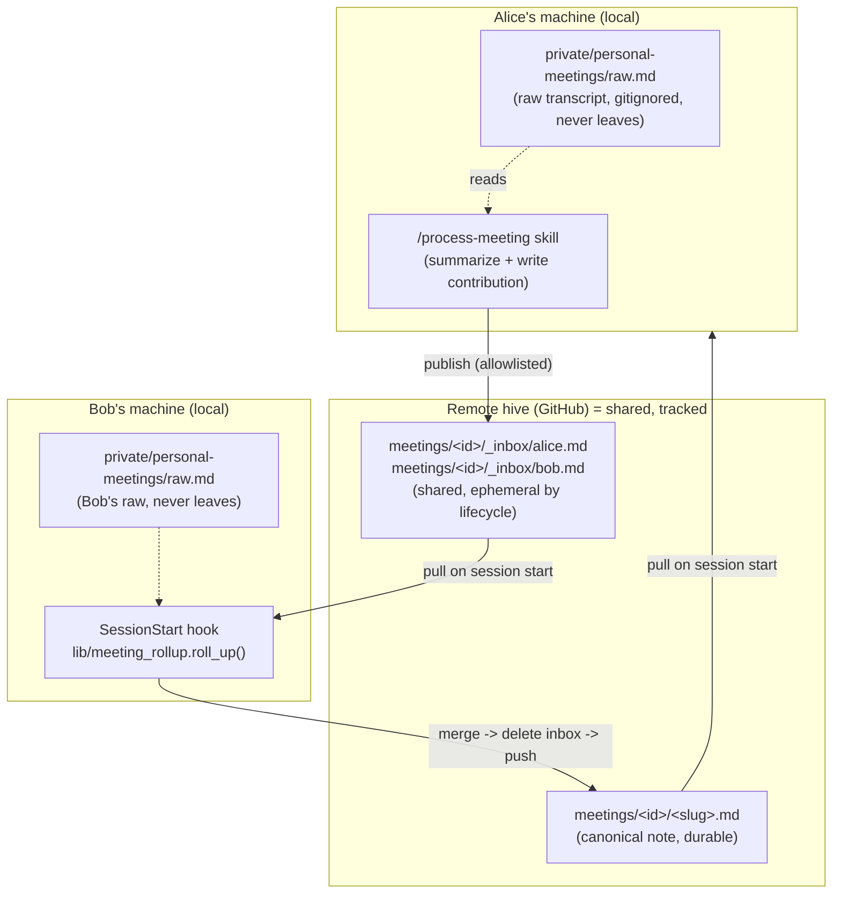

# Meeting flow + roll-up (sub-project 2)

> Sub-project 2 of the group hive brain. Builds on the walking skeleton (sub-project 1) and the master design in [2026-07-03-group-hive-brain-design.md](2026-07-03-group-hive-brain-design.md), sections 3.4, 3.5, 4.3, and 4.4, which this spec implements and refines.

## 1. Context and goals

The walking skeleton gives a team a shared git-backed vault with two sync hooks: a SessionStart pull and an explicit allowlisted publish. That is enough to share hand-written notes, but it does not yet deliver the flow that makes a shared brain earn its keep: several people in the same meeting, each producing notes, converging into **one** canonical record with no manual reconciliation and no lost contributions.

This sub-project builds that flow. When multiple attendees each process the same meeting, their contributions merge, deterministically and idempotently, into a single canonical note, while each attendee's raw transcript never leaves their machine.

**Goal:** a meeting produces exactly one shared canonical note, assembled from any number of attendees' contributions, with raw material kept private, merges deterministic, and the whole thing running client-side with no server or CI.

## 2. Non-goals and constraints

- **No server, no CI.** Everything runs locally on members' machines (consistent with the master design). Roll-up is opportunistic: whichever member's session starts next while contributions are pending performs the merge.
- **No transcript parsing in the harness.** Turning a raw transcript into a structured summary is assistant judgment, delivered as a thin skill, not deterministic harness code.
- **Raw material stays private.** Only the structured summary a member chooses to contribute is ever shared.
- **The merge must be deterministic and idempotent.** Re-running must not duplicate content or produce different output for the same inputs.

## 3. Where things run and where things live

Two questions dominate understanding this sub-project: *where does the code run* and *where does the data live*. They have different answers.

**All code runs locally, on each member's device.** There is no central compute. GitHub is dumb storage plus sync. The deterministic library and the summarization skill both execute inside a member's local Claude Code session.

**Data splits into private (local-only) and shared (git-tracked, therefore in the remote hive and in every clone).**



- **Raw transcript** — `private/personal-meetings/` — local only, gitignored, never pushed.
- **Inbox contribution** — `meetings/<id>/_inbox/<author>.md` — **shared** (tracked, pushed). It must be shared so another member's machine can merge it. "Ephemeral" means short-lived by lifecycle, not local: the roll-up deletes it once folded in, and that deletion is itself a commit that propagates.
- **Canonical note** — `meetings/<id>/<slug>.md` — **shared** and durable; the record everyone reads.

The privacy line is exactly the `/process-meeting` skill: raw material in, a structured summary the member chose to share out.

## 4. Key decisions

### 4.1 Scope: deterministic mechanics + a thin skill
The harness owns the deterministic, unit-tested plumbing: meeting-id helpers, the merge, the render, and the roll-up driver. A thin `/process-meeting` skill owns the non-deterministic part (summarizing a raw transcript into structured fields). The harness never parses a raw transcript.

### 4.2 Meeting-id agreement: discover-or-create by date + slug
For contributions to merge they must land in the same `meetings/<id>/`. The id is `YYYY-MM-DD-<slug>`. Before writing, the skill lists existing meeting directories for the date (`find_meeting_dirs`) and reuses a matching one, reconciling title variants ("standup" vs "daily standup") with assistant judgment; it creates a new id only when nothing matches. This is generic (no calendar or transcript-tool dependency) and converges as members sync. Accepted tradeoff: if two members create different ids for the same meeting before either has synced, two meeting directories result and are reconciled by a human later.

### 4.3 Inbox contribution: structured payload
An inbox contribution is a small file whose YAML front-matter is a structured payload (`decisions`, `action_items` as `{owner, text}`, `notes`, plus `meeting_id`, `title`, `date`, `author`). Structured input makes the merge trivial and bulletproof rather than requiring Markdown scraping. Inbox files are ephemeral, so they are optimized for machine-merging, not for reading.

### 4.4 Canonical note: YAML front-matter is the source of truth
The canonical note is one Markdown file. Its YAML front-matter holds the merged structured payload plus a `merged_authors` ledger; its body is the rendered human-readable sections. Re-merge reads the front-matter (not the prose), so it stays deterministic. This matches the front-matter convention used elsewhere in the system.

### 4.5 Roll-up: opportunistic, auto-push, best-effort, self-healing
On session start, after pull and control-plane, the hook scans for non-empty `_inbox/` directories and rolls each up: merge into the canonical note, delete the folded inbox files, then push with the same fetch-rebase-retry engine as publish. On an unresolvable conflict or exhausted retries it aborts cleanly (repo left clean), warns the user, and leaves the inbox intact so the next client retries. The session always continues. Roll-up only ever rearranges already-shared inbox data, so a session-start push never carries anything private.

## 5. Architecture

### 5.1 New module: `lib/meeting_rollup.py`
Pure, testable functions plus one repo-touching driver:
- `slugify(title) -> str` — deterministic slug for meeting ids and filenames.
- `find_meeting_dirs(repo, date) -> list[Path]` — existing meeting dirs for a date (input to discover-or-create).
- `normalize(text) -> str` — lowercase, collapse whitespace, strip trailing punctuation; used for dedupe keys.
- `parse_contribution(path) -> Contribution` / `parse_canonical(path) -> Canonical | None` — load structured payloads from front-matter.
- `merge(existing: Canonical | None, contributions: list[Contribution]) -> Canonical` — the deterministic core (rules below).
- `render(canonical: Canonical) -> str` — front-matter + rendered Markdown body.
- `roll_up(repo, meeting_dir) -> bool` — read canonical + all inbox files, merge, write canonical, delete folded inbox files; returns whether anything changed.

### 5.2 Merge rules (deterministic, idempotent)
- **decisions:** union, dedupe by `normalize(text)`; union the `by` attribution list.
- **action_items:** dedupe by `(normalize(owner), normalize(text))`; union `by`.
- **notes:** union, dedupe by `normalize(text)`.
- **ledger:** record each folded contribution as `{author, content_hash}` in `merged_authors`.
- **idempotency:** merge output is a pure function of `(existing canonical, contributions)`. Re-running on an empty inbox is a no-op (no commit). A late `<author>.md` whose hash is absent from the ledger folds into the same note. Two clients that see identical inputs produce byte-identical notes.

### 5.3 Data formats
Inbox contribution `meetings/<id>/_inbox/<author>.md`:
```yaml
---
meeting_id: 2026-07-04-standup
title: Daily Standup
date: 2026-07-04
author: alice
decisions: ["Ship v2 behind a flag"]
action_items:
  - {owner: bob, text: "Wire the feature flag"}
  - {owner: alice, text: "Draft rollout comms"}
notes: ["Discussed staging capacity"]
---
```

Canonical note `meetings/<id>/<slug>.md`:
```yaml
---
meeting_id: 2026-07-04-standup
title: Daily Standup
date: 2026-07-04
merged_authors:
  - {author: alice, content_hash: ab12...}
  - {author: bob,   content_hash: cd34...}
decisions:
  - {text: "Ship v2 behind a flag", by: [alice, bob]}
action_items:
  - {owner: bob, text: "Wire the feature flag", by: [alice]}
notes:
  - {text: "Discussed staging capacity", by: [alice]}
---
# Daily Standup - 2026-07-04
## Decisions
- Ship v2 behind a flag
## Action items
### bob
- Wire the feature flag
### alice
- Draft rollout comms
## Notes
- Discussed staging capacity
```

### 5.4 Shared push helper in `lib/gitsync.py`
Factor the fetch-rebase-retry push loop out of `publish` into a helper that stages a given set of paths **including deletions** (roll-up both writes the canonical note and deletes inbox files). Both `publish` and roll-up call it; the conflict behavior (abort clean, raise) is unchanged.

### 5.5 The `/process-meeting` skill
Vendored via `CONTROL/skills/process-meeting/` into clients' `.claude/skills/`. Steps:
1. Read a raw transcript from `private/personal-meetings/` (raw never leaves).
2. Summarize into `decisions` / `action_items` / `notes`.
3. Discover-or-create the meeting id (4.2), using `find_meeting_dirs` + `slugify`.
4. Write `meetings/<id>/_inbox/<author>.md` (author from git `user.email` or the personal-context profile).
5. Publish (the allowlist now includes `meetings/`).

### 5.6 Hook wiring
`client-kit/.claude/hooks/sync_pull.py` gains a step after pull + control-plane: for each non-empty `meetings/*/_inbox/`, call `roll_up`, stage the meeting dir (canonical write + inbox deletions), and push via the shared helper, with the best-effort failure behavior in 4.5.

### 5.7 Allowlist
`client-kit/publish_allowlist.txt` adds `meetings/` so contributions and roll-ups may publish.

## 6. Testing

- **Unit:** `slugify`, `normalize`, `merge` (union, dedupe, attribution union), idempotent re-merge, late-contribution fold-in, `render` matches front-matter.
- **Roll-up integration** (temp git repo): seed two inbox files, roll up, assert one correct canonical note and an empty inbox; second run is a no-op; add a third author and assert it folds into the same note.
- **End-to-end:** two clients contribute to the same meeting id; a third client's session-start rolls up; assert one canonical note, inbox gone, and `private/` never pushed.
- **Conflict path:** simulate a concurrent roll-up push rejection; assert abort-clean and inbox left intact.

## 7. Open questions and risks

- **Concurrent roll-up churn.** Two clients rolling up at once may both write the canonical note; fetch-rebase-retry lets one land and the other rebases. Because the merge is deterministic, they converge; worst case is a redundant commit or a retry. Accepted for the no-CI model.
- **Split meeting ids.** Pre-sync id divergence (4.2) needs human reconciliation. A future helper could detect near-duplicate meeting dirs and propose a merge.
- **Attribution granularity.** The `by` list records who contributed each item, not who originally said it in the meeting; that is a deliberate simplification.

## 8. Relationship to existing artifacts

Implements sections 3.4, 3.5, 4.3, and 4.4 of the master design. Reuses the walking skeleton's `lib/gitsync.py` push machinery and the SessionStart hook. Leaves the control plane (sub-project 3), TTL/freshness (sub-project 4), and the full installer/onboarding (sub-project 5) untouched.
