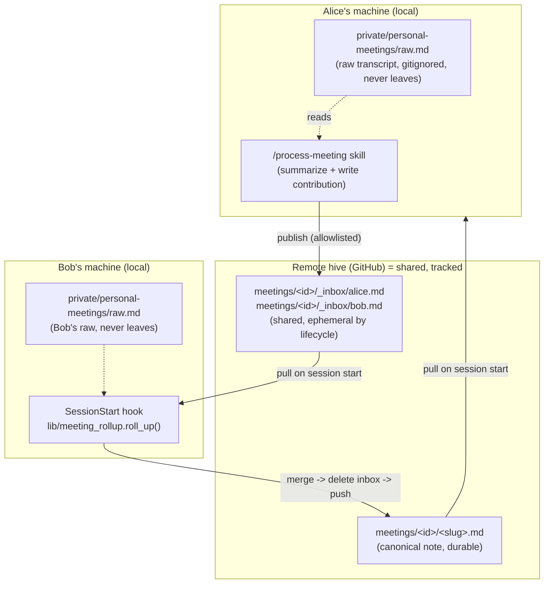

# Meeting flow + roll-up (sub-project 2)

> Sub-project 2 of the group hive brain. Builds on the walking skeleton (sub-project 1) and the master design in [2026-07-03-group-hive-brain-design.md](2026-07-03-group-hive-brain-design.md), sections 3.4, 3.5, 4.3, and 4.4, which this spec implements and refines.

## 1. Context and goals

The walking skeleton gives a team a shared git-backed vault with two sync hooks: a SessionStart pull and an explicit allowlisted publish. That is enough to share hand-written notes, but it does not yet deliver the flow that makes a shared brain earn its keep: several people in the same meeting, each producing notes, converging into **one** canonical record with no manual reconciliation and no lost contributions.

This sub-project builds that flow. When multiple attendees each process the same meeting, their contributions merge, deterministically and idempotently, into a single canonical note, while each attendee's raw transcript never leaves their machine.

**Goal:** a meeting produces exactly one shared canonical note, assembled from any number of attendees' contributions, with raw material kept private, merges deterministic, and the whole thing running client-side with no server or CI.

## 2. Non-goals and constraints

- **No server, no CI.** Everything runs locally on members' machines (consistent with the master design). Roll-up is opportunistic: whichever member's session starts next while contributions are pending performs the merge.
- **No transcript parsing in the harness.** Turning a raw transcript into a structured summary is assistant judgment, delivered as a thin skill, not deterministic harness code.
- **Raw material stays private.** Only the structured summary a member chooses to contribute is ever shared.
- **The merge must be deterministic and idempotent.** Re-running must not duplicate content or produce different output for the same inputs.

## 3. Where things run and where things live

Two questions dominate understanding this sub-project: *where does the code run* and *where does the data live*. They have different answers.

**All code runs locally, on each member's device.** There is no central compute. GitHub is dumb storage plus sync. The deterministic library and the summarization skill both execute inside a member's local Claude Code session.

**Data splits into private (local-only) and shared (git-tracked, therefore in the remote hive and in every clone).**



- **Raw transcript** — `private/personal-meetings/` — local only, gitignored, never pushed.
- **Inbox contribution** — `meetings/<id>/_inbox/<author>.md` — **shared** (tracked, pushed). It must be shared so another member's machine can merge it. "Ephemeral" means short-lived by lifecycle, not local: the roll-up deletes it once folded in, and that deletion is itself a commit that propagates.
- **Canonical note** — `meetings/<id>/<slug>.md` — **shared** and durable; the record everyone reads.

The privacy line is exactly the `/process-meeting` skill: raw material in, a structured summary the member chose to share out.

## 4. Key decisions

### 4.1 Scope: deterministic mechanics + a thin skill
The harness owns the deterministic, unit-tested plumbing: meeting-id helpers, the merge, the render, and the roll-up driver. A thin `/process-meeting` skill owns the non-deterministic part (summarizing a raw transcript into structured fields). The harness never parses a raw transcript.

### 4.2 Meeting-id agreement: discover-or-create by date + slug
For contributions to merge they must land in the same `meetings/<id>/`. The id is `YYYY-MM-DD-<slug>`. Because a session may be hours old, the skill first refreshes the tree (`git fetch` + rebase, or a pull) so it discovers meeting dirs other members have already published, then lists existing meeting directories for the date (`find_meeting_dirs`) and reuses a matching one, reconciling title variants ("standup" vs "daily standup") with assistant judgment; it creates a new id only when nothing matches. This is generic (no calendar or transcript-tool dependency) and converges as members sync. Accepted tradeoff: if two members create different ids for the same meeting before either has synced (even after the pre-write refresh, if they act within the same unsynced window), two meeting directories result and are reconciled by a human later. A future helper could detect near-duplicate meeting dirs and propose a merge.

### 4.3 Inbox contribution: structured payload
An inbox contribution is a small file carrying a structured JSON payload (`decisions`, `action_items` as `{owner, text}`, `notes`, plus `meeting_id`, `title`, `date`, `author`). Structured input makes the merge trivial and bulletproof rather than requiring Markdown scraping. Inbox files are ephemeral, so they are optimized for machine-merging, not for reading.

### 4.4 Canonical note: an embedded JSON payload is the source of truth
The canonical note is one Markdown file with two parts: a human-readable rendered body (the sections), and a machine-readable **fenced JSON block** (after a sentinel comment) holding the merged structured payload plus a `merged_authors` ledger. Re-merge reads the JSON block (not the prose), so it stays deterministic.

**Serialization decision (deviation from an earlier "YAML front-matter" phrasing):** the payload is serialized with stdlib `json.dumps(payload, sort_keys=True, ensure_ascii=False, indent=2)` plus a trailing newline. This keeps the harness zero-dependency (git + Python stdlib only, no PyYAML for members to install), safely round-trips arbitrary text (colons, quotes, unicode) that a hand-rolled YAML emitter would mishandle, and is itself the "pinned canonical serializer" (see 5.2): `sort_keys` + fixed `indent` make two independent renders of the same payload byte-identical.

The `merged_authors` ledger is **load-bearing for idempotency, not decorative**. Each entry is `{author, content_hash}`, where `content_hash` is defined in 5.2. On roll-up, a contribution whose `content_hash` is already in the ledger has already been folded: its items are not re-added; the inbox file is simply cleaned up. Only contributions with a hash absent from the ledger fold in. If no contribution carries a new hash, roll-up is a no-op (no rewrite, no commit). This is what makes re-running safe even when a prior roll-up's push failed and left the inbox in place.

**Merge semantics are additive, not retracting.** A late contribution from a *new* author folds in cleanly. A same-author *re-run* with changed wording produces a new `content_hash` and folds its new distinct items in (deduped by normalized text against what is already there); it does **not** retract items that author shared earlier. Retract/supersede is deliberately out of scope (YAGNI); the realistic case this sub-project serves is different attendees converging, not authors editing their own past contributions.

### 4.5 Roll-up: opportunistic, auto-push, best-effort, self-healing
On session start, **after** pull and control-plane, the hook scans for meeting inboxes with contribution files and rolls each up as an independent per-meeting transaction: merge new-hash contributions into the canonical note, delete the folded inbox files, commit only that meeting dir, then push with the same fetch-rebase-retry engine as publish. Meetings are processed one at a time; the worktree is clean (at the remote tip) between meetings, which is the precondition the pull/push engine requires.

**Invariant that makes the reset sound:** roll-up runs only *after* pull, and operates only on inbox files present at the current remote tip (i.e. already-shared, already-pushed contributions). A client never rolls up an inbox file it wrote locally but has not yet pushed. Because every folded inbox file already exists at `origin`, `git reset --hard <remote-tip>` on failure restores exactly those files, so no contribution can be lost by the reset. On an unresolvable conflict or exhausted retries for a meeting, the driver runs `git reset --hard <remote-tip>` for that transaction. That single action both discards the local roll-up commit and restores the deleted inbox files (or, if another client already landed the same merge upstream, leaves the already-merged state), so the repo is genuinely clean and the work either self-heals on the next session or is discovered already done. A warning is surfaced to the user; the session always continues, and a failure on one meeting does not block the others. Roll-up only ever stages paths under `meetings/<id>/`, and `private/` is gitignored, so a session-start push can never carry anything private.

## 5. Architecture

### 5.1 New module: `lib/meeting_rollup.py`
Pure, testable functions plus one repo-touching driver:
- `slugify(title) -> str` — deterministic slug for meeting ids and filenames.
- `find_meeting_dirs(repo, date) -> list[Path]` — existing meeting dirs for a date (input to discover-or-create).
- `normalize(text) -> str` — lowercase, collapse whitespace, strip trailing punctuation; used for dedupe keys.
- `parse_payload(path) -> dict | None` — locate the sentinel + fenced JSON block and `json.loads` it (used for both inbox contributions and canonical notes); returns None when no block is present.
- `content_hash(payload) -> str` — stable hash over the canonicalized payload (definition in 5.2).
- `merge(existing: dict | None, contributions: list[dict]) -> dict` — the deterministic core (rules below); folds only contributions whose hash is absent from the existing ledger.
- `render(canonical: dict) -> str` — rendered Markdown body + sentinel + pinned JSON block, with the total ordering from 5.2.
- `roll_up(repo, meeting_dir) -> bool` — read canonical + all `_inbox/*.md`, merge new-hash contributions, write canonical, delete the folded inbox files. Deletion is coupled to folding: when there are zero new-hash contributions it touches nothing and returns False (so the caller skips the commit and the worktree stays clean); otherwise it returns True.

### 5.2 Merge rules (deterministic, idempotent)
- **new-hash filter:** compute `content_hash` for each inbox contribution; skip (but clean up) any whose hash is already in `merged_authors`. Fold only the rest.
- **decisions:** union, dedupe by `normalize(text)`; union the `by` attribution list.
- **action_items:** dedupe by `(normalize(owner), normalize(text))`; union `by`.
- **notes:** union, dedupe by `normalize(text)`.
- **ledger:** append each folded contribution as `{author, content_hash}` to `merged_authors`. A same-author re-run adds a second entry (a second hash) for that author; that is expected. The ledger keeps all entries (it is the skip-guard for already-folded contributions), and its sort key is the total `(author_id, content_hash)` so ordering is deterministic even with multiple entries per author.
- **`content_hash` definition:** `sha256` (hex, first 12 chars in examples) over a **canonicalized serialization of the payload fields only** (`decisions`, `action_items`, `notes`): each list normalized (`normalize` applied to text and owner) and sorted by its dedupe key, then `json.dumps(..., sort_keys=True, ensure_ascii=False)`, excluding volatile metadata (`title`, `date`, `author`) and excluding `by` attribution. This makes the hash stable and independent of key ordering, so two authors who summarized identically hash identically.
- **deterministic output ordering:** `render` imposes a total order on every list: `decisions` and `notes` sorted by `normalize(text)`; `action_items` grouped by owner then sorted by `normalize(text)`; `by` lists sorted by author-id; `merged_authors` sorted by `(author_id, content_hash)`. Union order must never depend on contribution processing order.
- **pinned canonical serializer:** the machine JSON block is emitted with `json.dumps(payload, sort_keys=True, ensure_ascii=False, indent=2)` + trailing newline; the rendered body is generated deterministically from the ordered payload. Byte-identity is a property of *this serializer plus the ordering above*, not of the merge logic alone. A unit test asserts two independent renders of the same payload are byte-identical.
- **idempotency:** merge output is a pure function of `(existing canonical, contributions)`. Re-running with no new-hash contributions is a no-op (no commit). A late contribution (new author, or a same-author re-run with changed wording) carries a new hash and folds into the same note.
- **concurrency safety does not depend on byte-identity.** The correctness guarantee is the per-meeting transaction with reset-to-remote-tip on failure (4.5): nothing is lost or double-counted regardless of serialization. Byte-identity is only an optimization: when two clients render identical bytes, one client's rebase drops as an empty commit (the clean common case); when they differ, the loser resets and finds the work already done. Both paths are safe.

### 5.3 Data formats
A single sentinel comment marks the machine block in every file: `<!-- team-brain-harness:rollup-data -->`, immediately followed by a fenced ```json block. Parsers locate the sentinel and load the fenced JSON; everything before it is human-facing text (empty in inbox files).

Inbox contribution `meetings/<id>/_inbox/<author-id>.md` (payload only; ephemeral):
```
<!-- team-brain-harness:rollup-data -->
```json
{
  "meeting_id": "2026-07-04-standup",
  "title": "Daily Standup",
  "date": "2026-07-04",
  "author": "alice",
  "decisions": ["Ship v2 behind a flag"],
  "action_items": [
    {"owner": "bob", "text": "Wire the feature flag"},
    {"owner": "alice", "text": "Draft rollout comms"}
  ],
  "notes": ["Discussed staging capacity"]
}
```(closing fence)
```

Canonical note `meetings/<id>/<slug>.md` (rendered body + machine block):
```
# Daily Standup - 2026-07-04

## Decisions
- Ship v2 behind a flag

## Action items
### alice
- Draft rollout comms
### bob
- Wire the feature flag

## Notes
- Discussed staging capacity

<!-- team-brain-harness:rollup-data -->
```json
{
  "meeting_id": "2026-07-04-standup",
  "title": "Daily Standup",
  "date": "2026-07-04",
  "merged_authors": [
    {"author": "alice", "content_hash": "ab12..."},
    {"author": "bob", "content_hash": "cd34..."}
  ],
  "decisions": [{"by": ["alice", "bob"], "text": "Ship v2 behind a flag"}],
  "action_items": [{"by": ["alice"], "owner": "bob", "text": "Wire the feature flag"}],
  "notes": [{"by": ["alice"], "text": "Discussed staging capacity"}]
}
```(closing fence)
```
(Object keys shown in `sort_keys=True` order; the `(closing fence)` annotation stands in for a literal ```` ``` ```` so this example can nest in the spec.)

### 5.4 Shared push helper in `lib/gitsync.py`
Factor the fetch-rebase-retry push loop out of `publish` into a helper that stages a given set of paths **including deletions** (roll-up both writes the canonical note and deletes inbox files). Deletions are captured by staging the **directory pathspec** (`git add -- meetings/<id>/`), which records added, modified, and removed tracked files under it, rather than adding now-deleted file paths individually (which some git versions treat as a no-op that misses the removal). The staged pathset for a roll-up is constructed **only** from paths under `meetings/<id>/`, so it can never include a `private/` path; combined with the gitignore on `private/`, that makes the "never carries anything private" invariant explicit rather than incidental. Both `publish` and roll-up call the helper. Its own conflict behavior (rebase abort, raise) is unchanged; the roll-up driver (5.6) wraps a raised failure in the reset-to-remote-tip cleanup from 4.5 so the worktree is left clean for the next per-meeting transaction and the next `pull`.

### 5.5 The `/process-meeting` skill
Vendored via `CONTROL/skills/process-meeting/` into clients' `.claude/skills/`. Steps:
1. Read a raw transcript from `private/personal-meetings/` (raw never leaves).
2. Summarize into `decisions` / `action_items` / `notes`.
3. Refresh the tree (fetch + rebase / pull) **before** writing anything, then discover-or-create the meeting id (4.2), using `find_meeting_dirs` + `slugify`. This ordering is load-bearing: the refresh must run against a clean tree (its rebase raises on conflict, like any pull), so it precedes the inbox write in step 4.
4. Write `meetings/<id>/_inbox/<author-id>.md`.
5. Publish (`meetings/` is already allowlisted).

**Author-id (single canonical source, used for the inbox filename, `by`, and `merged_authors`):** a stable handle from the member's `personal-context` profile if present; otherwise the slugified local-part of git `user.email` (e.g. `alice@x.com` -> `alice`), via the same `slugify` rules. Exactly one source is chosen per member and used consistently everywhere, so a member never appears under two identities and their inbox filename is stable across re-runs.

### 5.6 Hook wiring
`client-kit/.claude/hooks/sync_pull.py` gains a step after pull + control-plane: enumerate meeting inboxes by scanning `meetings/*/_inbox/*.md` specifically (stray non-`.md` files such as a macOS `.DS_Store` are ignored, so they never trigger a spurious roll-up). For each meeting that has at least one contribution file, run the per-meeting transaction from 4.5: `roll_up` (fold new-hash contributions, write canonical, delete folded inbox files) -> stage the meeting dir (writes + deletions) -> push via the shared helper. On failure, `git reset --hard <remote-tip>` for that transaction and continue to the next meeting. A meeting whose contributions are all already-folded (ledger-known, no new hash) is a **true** no-op: `roll_up` returns False and touches nothing (no deletion, no commit), so the worktree stays clean for the next meeting and the next `pull`. Inbox deletion happens only coupled to a committed fold, never as an uncommitted cleanup. (At a consistent remote tip a ledger-known contribution and its inbox file cannot both be present, since folding and deletion are one atomic commit; the no-op is defensive.)

### 5.7 Allowlist
`meetings/` is already present in `client-kit/publish_allowlist.txt`, so no allowlist change is required; contributions and roll-ups publish under it as-is. (Called out only to confirm the path is covered.)

## 6. Testing

- **Unit:** `slugify`, `normalize`, `merge` (union, dedupe, attribution union), idempotent re-merge, late-contribution fold-in, `render` matches front-matter.
- **Roll-up integration** (temp git repo): seed two inbox files, roll up, assert one correct canonical note and an empty inbox; second run is a no-op; add a third author and assert it folds into the same note.
- **End-to-end:** two clients contribute to the same meeting id; a third client's session-start rolls up; assert one canonical note, inbox gone, and `private/` never pushed.
- **Conflict path:** simulate a concurrent roll-up push rejection; assert abort-clean and inbox left intact.

## 7. Open questions and risks

- **Concurrent roll-up.** Two clients that pull the same state may both merge and commit an identical canonical note plus identical inbox deletions. One push lands. The other's push is rejected and it rebases; since the changes are byte-identical to what already landed, the rebase either drops the replayed commit as empty (a clean no-op) or the shared engine raises, in which case the driver resets to the remote tip (4.5) and finds the work already done. There is no "both land twice" outcome and nothing is lost. The only cost is an occasional wasted merge+reset. Accepted for the no-CI model.
- **Split meeting ids.** The pre-write refresh in 4.2 closes the common stale-clone case, but two members acting inside the same unsynced window can still create divergent ids, which needs human reconciliation. A future helper could detect near-duplicate meeting dirs and propose a merge.
- **Same-author re-runs accumulate variants.** Because merge is additive (4.4), an author who re-processes a meeting with reworded items adds new distinct items rather than replacing their earlier ones. Deduping only catches exact (normalized) matches. This is an accepted simplification; retract/supersede is out of scope.
- **Attribution granularity.** The `by` list records who contributed each item, not who originally said it in the meeting; that is a deliberate simplification.
- **User-visible failure surface.** On a roll-up abort (4.5) the user sees a one-line warning naming the meeting that could not be rolled up; the detailed retry is silent and automatic on the next session. The exact wording is a plan-level detail.

## 8. Relationship to existing artifacts

Implements sections 3.4, 3.5, 4.3, and 4.4 of the master design. Reuses the walking skeleton's `lib/gitsync.py` push machinery and the SessionStart hook. Leaves the control plane (sub-project 3), TTL/freshness (sub-project 4), and the full installer/onboarding (sub-project 5) untouched.
